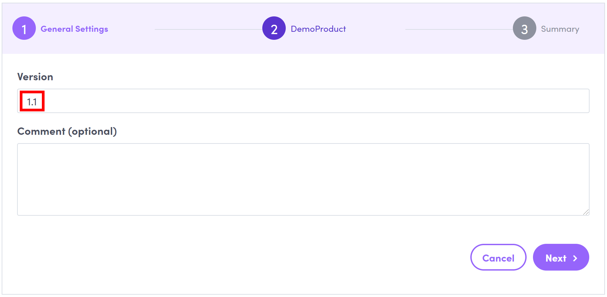
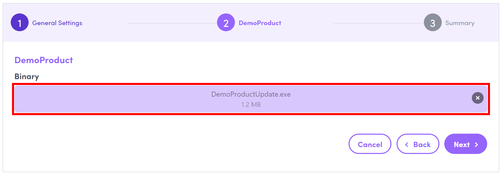
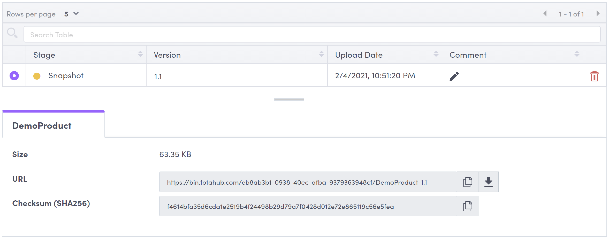

# How to upload a firmware version to FotaHub

1. Go to [FotaHub](https://fotahub.com) and sign in with your existing account if not yet done so.

2. Go to the `Products` dashboard and find your product. Click on the product name to open its details view:

3. Click on `Upload firmware`, and choose the `Upload with wizard` option: 

4. Enter the version of the firmware to be uploaded and optionally a comment. The version format must match the firmware versioning scheme defined upon product creation:

5. Click on `Next` to get to the binary upload page. Drag & drop or browse the binary of the new firmware version to be uploaded:  

> &#x1F6C8; If you have opted for `Signature` instead of `Checksum` as binary verification method for your product, you will be required to provide also the signature of the new firmware version. It must be based on the signature algorithm that you have configured upon product creation or through the product settings.

1. Click on `Next` and then on `Upload` to start the firmware upload process. When completed, you will get redirected back to the product details view and see the newly uploaded firmware version along with its properties. Most importantly, you will be able to find the firmware binary download URL and its checksum that has been automatically calculated based on the binary checksum algorithm chosen upon product creation: 

> &#x1F6C8; If you have opted for `Signature` instead of `Checksum` as binary verification method for your product, the signature uploaded along with the new firmware version will be displayed instead of its checksum.