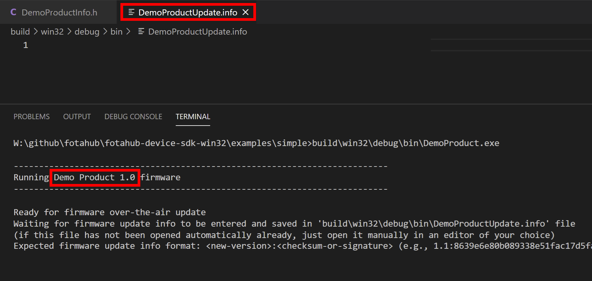
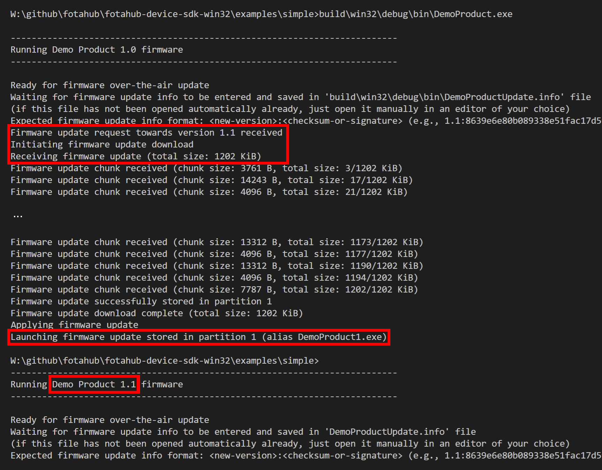

# Simple FOTA update example

The *Simple* example demonstrates the most straight forward manner to make firmware over-the-air updates with FotaHub. It is kind of a "Hello World" example for FOTA updating and a perfect way to get started in that field.

## Operating principle

In this example, your Windows desktop computer will be used as an imaginary IoT device. A FotaHub product will be set up to provide firmware updates for the same. The IoT device firmware is actually going to be an executable program (i.e., a Windows EXE file). It demonstrates a full firmware update cycle using FotaHub directly on your Windows machine.

The firmware program is going to be named after the corresponding FotaHub product (e.g., `DemoProduct.exe`). Right after being launched, it creates and opens a file named `DemoProductUpdate.info` that is located in the same folder as the firmware program. It waits until a firmware update info string is entered and saved in this file. The latter is expected to consist of the new firmware version the device should be updated to followed by a ':' separator and the checksum or signature of the new firmware version:

`<new-version>:<verification-data>` 

For example:

`1.1:a15d5599d8745ff4f51690eb3996afcf75d0b1729d1b8cda2491b03940417521`

Once a valid update info string has been found in the `DemoProductUpdate.info` file and the contained new firmware version is different from the version of the already running firmware program, the firmware update procedure is triggered. It involves your Windows desktop computer to connect to FotaHub and download the binary (i.e., the Windows EXE file) of the new firmware version. Thereby, it uses a dedicated URL including the id of the product representing the device in FotaHub, and the name and the version of the firmware binary to be retrieved, e.g.:

`https://bin.fotahub.com/7de41f5a-9442-46c7-92d8-d0ea83eebddf/DemoProduct-1.1`

The downloaded firmware binary is stored in a new firmware program file that has the same name as the original one followed by an imaginary partition index '1' (e.g., `DemoProduct1.exe`). At the same time, the downloaded firmware binary's checksum or signature is recalculated and compared to the checksum or signature included in the previously communicated update info string. If both match, the firmware update is applied by loading and executing the new firmware program file as a new child process. This causes the original firmware program to be replaced with a running instance of the new firmware version downloaded from FotaHub.  

## Installation

A description of the tools that must be available on your laptop or computer and advise how to install them can be found [here](../../README.md#installation).

## Usage

### Create a FotaHub product

Create a FotaHub product that represents your device in FotaHub as explained [here](../fotahub/create-product.md). It will be used to upload and provide firmware updates for the same. 

### Get the FotaHub Device SDK for Windows

If not yet done so, either clone or download and uncompress the [FotaHub Device SDK for Windows](https://github.com/fotahub/fotahub-device-sdk-win32) to a location of your choice on your machine. 

> &#x26A0; Make sure that the path to the location of the FotaHub Device SDK for Windows on your machine does not contain any spaces.

### Create initial firmware version

1. Start Visual Studio Code and open (`File` > `Folder...`) the `Simple` example included in the FotaHub Device SDK for Windows (`<device-sdk-root>\examples\simple`).

2. Open the `DemoProductInfo.h` file, and initialize the `DEMO_PRODUCT_ID` and `DEMO_PRODUCT_NAME` constants with the id and the name of the previously created FotaHub product (see `Products` > `{{Your FotaHub product}}` > `Settings` > `General` at [Fotahub](https://fotahub.com)). Leave the `DEMO_PRODUCT_FIRMWARE_VERSION` as is for now. In case you have selected anything else than `SHA256` as the binary checksum algorithm for your FotaHub product or opted for using a signature instead, you also must adjust the `DEMO_PRODUCT_FIRMWARE_UPDATE_VERIFICATION_ALGORITHM` constant accordingly:

    ```c
    #define DEMO_PRODUCT_ID "7de41f5a-9442-46c7-92d8-d0ea83eebddf"

    #define DEMO_PRODUCT_NAME "Demo Product"

    #define DEMO_PRODUCT_FIRMWARE_VERSION "1.0"

    #define DEMO_PRODUCT_FIRMWARE_UPDATE_VERIFICATION_ALGORITHM FOTA_UPDATE_VERIFICATION_ALGORITHM_SHA256
    ```

3. Open the integrated terminal (`Terminal` > `New Terminal`) and build the example by typing the following command:
   
    ```bat
    make
    ```

4. You can find the resulting firmware program (i.e., Windows EXE file) in the `build\win32\debug\bin` folder (using the `Explorer` view). Its name equals the name of the FotaHub product configured in the `DemoProductInfo.h` file without spaces (e.g., `DemoProduct.exe`).

### Create and upload a new firmware version to FotaHub

1. Go back to the `DemoProductInfo.h` file, and bump the `DEMO_PRODUCT_FIRMWARE_VERSION` constant:

    ```c
    #define DEMO_PRODUCT_FIRMWARE_VERSION "1.1"
    ```

2. Rebuild the example by typing the following command in the integrated terminal:

    ```bat
    make UPDATE=y
    ```

3. Locate the resulting new firmware program in the  `build\win32\debug\bin` folder (using the `Explorer` view). Its name is the name of the FotaHub product configured in the `DemoProductInfo.h` file without spaces followed by an `Update` suffix (e.g., `DemoProductUpdate.exe`).
   
    > &#x1F6C8; You can locate the new firmware program file also in Windows Explorer or copy its path to the clipboard by using corresponding context menu actions in Visual Studio Code (`Reveal in File Explorer` and `Copy Path`). This can come quite handy in the subsequent steps.

4. Upload the new firmware program (e.g., `DemoProductUpdate.exe`) as firmware version `1.1` to your FotaHub product as explained [here](../fotahub/upload-firmware.md).

### Make your first firmare over-the-air update 

1. Go back to Visual Studio Code and launch the initial firmware version by typing the following command in the integrated terminal. Choose the firmware program name according to your FotaHub product name, e.g., `DemoProduct.exe`:

    ```bat
    build\win32\debug\bin\<product-name>.exe
    ```

2. The firmware program prints a banner including the product name and the initial firmware version into the terminal output. It also creates and opens the `DemoProductUpdate.info` file directly in Visual Studio Code (if the latter is not installed on your machine, you will need to open the `DemoProductUpdate.info` file manually in an editor of you choice):
   
     

3. Enter the new firmware version followed by a ':' separator and the checksum or signature of the same (see `Products` > `{{Your FotaHub product}}` > `Details` > `{{New firmware version}}` at [Fotahub](https://fotahub.com)) in the `DemoProductUpdate.info` file and save it.

     

4. This will trigger the firmware over-the-air update procedure. Upon successful completion, the initial firmware program exits and the new firmware version downloaded from FotaHub is started automatically. To verify that, check the firmware version in the banner being printed into the terminal output:

    

    > &#x26A0; Under certain conditions, it may happen that you encounter an `I/O error during handling of downloaded firmware chunk` right after the firmware over-the-air update procedure has been started. In this case,  check if there are any duplicate instances of the firmware program running on your machine. Kill all of them (using the Windows Task Manager, e.g.) and restart the firmware program.