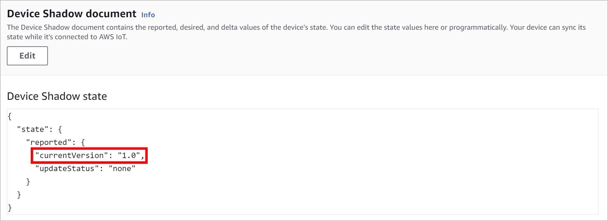

# AWS IoT Thing Shadow-driven FOTA update example

The *Thing Shadow* example demonstrates a real-world firmware over-the-air update procedure using the AWS IoT Thing Shadow (aka Device Shadow) service. The thing shadow is used to trigger firmware over-the-air updates on the device it represents through the cloud. The thing shadow example also detects misbehaving firmware updates and rolls them back to the previous version.

## Technical context

If you are new to AWS IoT in general or the AWS IoT Thing Shadow service, you can find relevant introductory as well as detailed technical information [here](https://docs.aws.amazon.com/iot/latest/developerguide/what-is-aws-iot.html) and [here](https://docs.aws.amazon.com/iot/latest/developerguide/iot-device-shadows.html).

For the sake of simplicity, an unnamed *classic shadow* is used in this example. The standard [MQTT protocol](https://mqtt.org) and the [thing shadow MQTT topics](https://docs.aws.amazon.com/iot/latest/developerguide/reserved-topics.html#reserved-topics-shadow) defined by AWS are used for the communication between the device and its thing shadow.

## Operating principle

In this example, your Windows desktop computer will be used as an imaginary IoT device. An AWS IoT thing will be created and used to represent this IoT device in the cloud and a FotaHub product will be set up to provide firmware updates for the same. The IoT device firmware is actually going to be an executable program (i.e., a Windows EXE file). It demonstrates a full firmware update cycle using FotaHub that can be triggered through the cloud using the AWS Thing Shadow your IoT device will be associated with.

The firmware program is going to be named after the corresponding FotaHub product (e.g., `DemoProduct.exe`). Right after being launched, it connects to its AWS IoT Thing Shadow. It reports the currently running firmware version resulting in a shadow state document as follows:

```json
{
    "state": {
        "reported": {
            "currentVersion": "1.0",
            "updateStatus": "none"
        }
    }
}
```

From there on, the device listens for MQTT messages being published at the `ShadowTopicPrefix/update/delta` topic. It retrieves the delta state document from the body of such messages, and checks whether it includes a new firmware version the device should be updated to as well as the verification data, i.e., the checksum or signature of the new firmware version like in the following example:

```json
{
    "state": {
        "newVersion": "1.1",
        "verificationData": "a15d5599d8745ff4f51690eb3996afcf75d0b1729d1b8cda2491b03940417521"
        }
    },
    ...
}
```

When this is the case, a firmware update procedure is triggered. It involves the device to disconnect from its AWS IoT Thing Shadow, connect to FotaHub and download the binary (i.e., the Windows EXE file) of the new firmware version. Thereby, it uses a dedicated URL including the id of the product representing the device in FotaHub, and the name and the version of the firmware binary to be retrieved, e.g.:

`https://bin.fotahub.com/7de41f5a-9442-46c7-92d8-d0ea83eebddf/DemoProduct-1.1`

The downloaded firmware binary is stored in a new firmware program file that has the same name as the original one followed by an imaginary partition index '1' (e.g., `DemoProduct1.exe`). At the same time, the downloaded firmware binary's checksum or signature gets recalculated and compared to the checksum or signature included in the previously received delta state document. If both match, the firmware update gets activated by loading and executing the new firmware program file as a new child process. This causes the original firmware program to be replaced with a running instance of the new firmware version downloaded from FotaHub.  

After the restart, the device starts executing the new firmware version downloaded from FotaHub. To be sure that it behaves as expeced, a built-in self test procedure is launched. Only when the latter completes successfully, the new firmware version is confirmed and becomes definite. In the opposite case, the previous firmware version is restored.

For obvious reasons, the ultimately required self test logic depends heavily on the nature of the underlying IoT application and device. The thing shadow example therefore implements only a very simple self test stub which returns a positive or negative result on a pseudo-random basis (see [DemoFOTAUpdateSelfTest.c](../../examples/thingshadow/DemoFOTAUpdateSelfTest.c) for details). Consequently, the firmware update carried out in this example may succeed and remain in place or fail and be rolled back to the previous version depending on how it goes. To see both scenarios happening, just run the same example multiple times. You can also force either of them by setting the `SIMULATED_ACTIVATION_SUCCESS_RATE` constant in [DemoFOTAUpdateSelfTest.h](../../examples/thingshadow/DemoFOTAUpdateSelfTest.h) to `100` or `0`.

## Installation

A description of the tools that must be available on your laptop or computer and advise how to install them can be found [here](../../README.md#installation).

## Usage

### Create an AWS IoT thing

1. If you have never used AWS so far, you must create a new AWS account first. You can follow the steps described [here](https://docs.aws.amazon.com/iot/latest/developerguide/setting-up.html) to do so.

2. Log in to the [AWS IoT Console](https://console.aws.amazon.com/iot/home) and set up an AWS IoT thing for your device: 
   * Create an AWS IoT policy which authorizes your device to exchange messages with AWS IoT 
   * Create the AWS IoT thing itself along with an X.509 device certificate that is used to authenticate your device to AWS IoT

<p style="margin-left: 2em">A comprehensive guide explaining how to proceed in detail can be found <a href="https://docs.aws.amazon.com/iot/latest/developerguide/create-iot-resources.html">here</a>.</p> 

3. Delete the initially created unnamed classic shadow of your AWS IoT thing (`Manage > Things > {{Your AWS IoT thing}} > Device Shadows > Classic Shadow > Delete` when using the *New console experience* which can be activated all down in the left side bar).

### Create a FotaHub product

Create a FotaHub product that represents your device in FotaHub as explained [here](../fotahub/create-product.md). It will be used to upload and provide firmware updates for the same. 

### Get the FotaHub Device SDK for Windows

If not yet done so, either clone or download and uncompress the [FotaHub Device SDK for Windows](https://github.com/fotahub/fotahub-device-sdk-win32) to a location of your choice on your machine. 

> &#x26A0; Make sure that the path to the location of the FotaHub Device SDK for Windows on your machine does not contain any spaces.

### Create initial firmware version

1. Start the Visual Studio Code and open (`File > Folder...`) the `Thing Shadow` example included in the FotaHub Device SDK for Windows (`<device-sdk-root>\examples\thingshadow`).

2. Open the `DemoProductInfo.h` file and initialize the `DEMO_PRODUCT_ID` and `DEMO_PRODUCT_NAME` constants with the id and the name of the previously created FotaHub product (see `Products > {{Your FotaHub product}} > Settings > General` at [Fotahub](https://fotahub.com)). Leave the `DEMO_PRODUCT_FIRMWARE_VERSION` as is for now. In case you have selected anything else than `SHA256` as the binary checksum algorithm for your FotaHub product or opted for using a signature instead, you also must adjust the `DEMO_PRODUCT_FIRMWARE_UPDATE_VERIFICATION_ALGORITHM` constant accordingly:

```c
#define DEMO_PRODUCT_ID "7de41f5a-9442-46c7-92d8-d0ea83eebddf"

#define DEMO_PRODUCT_NAME "Demo Product"

#define DEMO_PRODUCT_FIRMWARE_VERSION "1.0"

#define DEMO_PRODUCT_FIRMWARE_UPDATE_VERIFICATION_ALGORITHM FOTA_UPDATE_VERIFICATION_ALGORITHM_SHA256
```

3. Open the `AWSIoTThingShadowConfiguration.c` file and initialize the `hostNameEndPoint.hostName` and `awsIoTConnParams.thingName` struct variable fields with your AWS account's [device data endpoint](https://docs.aws.amazon.com/iot/latest/developerguide/iot-connect-devices.html#iot-connect-device-endpoints) and the name of the previously created AWS IoT thing (see `Settings > Device data endpoint` and `Manage > Things` in the [AWS IoT Console](https://console.aws.amazon.com/iot/home) when using the *New console experience* which can be activated all down in the left side bar):

```c
HostNameEndpointAddress_t hostNameEndPoint = 
{
  ...
  .hostName = "c1bskcyiphilz6-ats.iot.eu-central-1.amazonaws.com"
};

...

AWSIoTConnectionParameters_t awsIoTConnParams = 
{
  .thingName = "FotaHubExampleThing", 
  ...
};
```

4. Open the `Certificate.pem` and `PrivateKey.pem` files included in the thing shadow example. Replace all their content with that from the certificate and private key files which you have created and downloaded during the setup of the AWS IoT thing for your device. Those are typically named something like `3d19eba035-certificate.pem.crt` and `3d19eba035-private.pem.key`. 
   
5. Open the integrated terminal (`Terminal > New Terminal`) and build the example by typing the following command:
   
```bat
make
```

6. You can find the resulting firmware program (i.e., Windows EXE file) in the `build\win32\debug\bin` folder (using the `Explorer` view). Its name equals the name of the FotaHub product configured in the `DemoProductInfo.h` file without spaces (e.g., `DemoProduct.exe`).

### Create and upload a new firmware version to FotaHub

1. Go back to the `DemoProductInfo.h` file, and bump the `DEMO_PRODUCT_FIRMWARE_VERSION` constant:

```c
#define DEMO_PRODUCT_FIRMWARE_VERSION "1.1"
```

2. Rebuild the example by typing the following command in the integrated terminal:

```bat
make UPDATE=y
```

3. Locate the resulting new firmware program in the  `build\win32\debug\bin` folder (using the `Explorer` view). Its name is the name of the FotaHub product configured in the `DemoProductInfo.h` file without spaces followed by an `Update` suffix (e.g., `DemoProductUpdate.exe`).
   
> &#x1F6C8; You can locate the new firmware program file also in Windows Explorer or copy its path to the clipboard using corresponding Visual Studio Code context menu actions (`Reveal in File Explorer` and `Copy Path`). This can come quite handy in the subsequent steps.

4. Upload the new firmware program (e.g., `DemoProductUpdate.exe`) as firmware version `1.1` to your FotaHub product as explained [here](../fotahub/upload-firmware.md).

### Perform a cloud-triggered firmare over-the-air update 

1. Go back to Visual Studio Code and launch the initial firmware version by typing the following command in the integrated terminal. Choose the firmware program name according to your FotaHub product name, e.g., `DemoProduct.exe`:

```bat
build\win32\debug\bin\<product-name>.exe
```

2. The firmware program prints a banner including the product name and the initial firmware version into the terminal output and connects to its AWS IoT Thing Shadow:
   
 

1. Go back to the [AWS IoT Console](https://console.aws.amazon.com/iot/home) and visit the unnamed classic shadow of your AWS IoT thing (`Manage > Things > {{Your AWS IoT thing}} > Device Shadows > Classic Shadow` when using the *New console experience* which can be activated all down in the left side bar). Click on the refresh button if no such is displayed. You should see that it yields a shadow state document with a `currentVersion` attribute that indicates the currently running firmware version on your device:



You are now ready to perfom a cloud-triggered firmare over-the-air update. You can do so either [interactively](#interactive-firmare-over-the-air-update-using-the-aws-iot-console) through the AWS IoT Console or [programmatically](#programmatic-firmare-over-the-air-update-using-the-aws-cli) by using the AWS CLI.

#### Interactive firmare over-the-air update using the AWS IoT Console

1. Go back to the [AWS IoT Console](https://console.aws.amazon.com/iot/home) and revisit the unnamed classic shadow of your AWS IoT thing (`Manage > Things > {{Your AWS IoT thing}} > Device Shadows > Classic Shadow` when using the *New console experience* which can be activated all down in the left side bar). Open the shadow state document for editing (`Device Shadow document > Edit`). Add a `desired` object with a `newVersion` attribute to indicate the new firmware version your device should be updated to and a `verificationData` attribute with the checksum or signature of the same (see `Products > {{Your FotaHub product}} > Details > {{New firmware version}}` at [Fotahub](https://fotahub.com)):

```json
{
    "state": {
        "reported": {
            "currentVersion": "1.0",
            "updateStatus": "none"
        },
        "desired": {
            "newVersion": "1.1",
            "verificationData": "<checksum or signature>"
        }
    }
}
```

2. Save the modified shadow state document (`Edit Device Shadow state > Update`). This will trigger the firmware over-the-air update procedure. Upon successful completion, the initial firmware program exits and the new firmware version downloaded from FotaHub is started automatically. The built-in self test is executed and, in case it succeeds, the new firmware version is confirmed and stays in place. You can see that
   * in the **terminal output** of the firmware program - it should show a banner with the product name and the new firmware version followed by some messages wrt the validation and confirmation of the same  
   * by inspecting the **shadow state document** in the AWS IoT Console - it should reflect the new firmware version as the currently running version and include an `updateStatus` attribute indicating the successful completion of the firmware over-the-air update:
   


<p style="margin-left: 2em">In case the built-in self test fails, the new fimware version initiates the reversion of the firmware update and exits. The previous firmware version is resumed right after. You can see that
<ul>
    <ul>
    <li>in the <strong>terminal output</strong> of the firmware program - it should show a banner with the product name and the new firmware version followed by some messages wrt the validation and the reversion of the same, and then another banner with the product name and the initial firmware version</li>
    <li>by inspecting the <strong>shadow state document</strong> in the AWS IoT Console - it should reflect the initial firmware version as the currently running version and include an <code>updateStatus</code> attribute indicating the failure of the firmware over-the-air update:</li>
    </ul>
</ul>
</p> 


#### Programmatic firmare over-the-air update using the AWS CLI

1. If not already done so, [install](https://docs.aws.amazon.com/cli/latest/userguide/install-cliv2.html) and [configure](https://docs.aws.amazon.com/cli/latest/userguide/cli-configure-quickstart.html#cli-configure-quickstart-config) the AWS CLI version 2.

2. Go back to the integrated terminal and split it (`Terminal > Split Terminal`). Trigger a firmware over-the-air update for your device by entering an [aws iot-data publish](https://awscli.amazonaws.com/v2/documentation/api/latest/reference/iot-data/publish.html) command as shown below. Provide the name of your AWS IoT thing, the new firmware version your device should be updated to as well as the checksum or signature of the same (see `Products > {{Your FotaHub product}} > Details > {{New firmware version}}` at [Fotahub](https://fotahub.com)):

**Windows:**   
```bat
aws iot-data publish --topic $aws/things/<Your AWS IoT thing>/shadow/update --cli-binary-format raw-in-base64-out --payload "{\"state\":{\"desired\":{\"newVersion\":\"1.1\",\"verificationData\":\"<checksum or signature>\"}}}"
```
**Linux/Mac OS X:**   
```sh
aws iot-data publish --topic \$aws/things/<Your AWS IoT thing>/shadow/update --cli-binary-format raw-in-base64-out --payload '{"state":{"desired":{"newVersion":"1.1","verificationData":"<checksum or signature>"}}}'
```

3. Upon successful completion, the initial firmware program exits and the new firmware version downloaded from FotaHub is started automatically. The built-in self test is executed and, in case it succeeds, the new firmware version is confirmed and stays in place. You can see that
   * in the **terminal output** of the firmware program - it should show a banner with the product name and the new firmware version followed by some messages wrt the validation and confirmation of the same 
   * by retrieving the **shadow state document** using the [aws iot-data get-thing-shadow](https://awscli.amazonaws.com/v2/documentation/api/latest/reference/iot-data/get-thing-shadow.html) command as follows - it should reflect the new firmware version as the currently running version and include an `updateStatus` attribute indicating the successful completion of the firmware over-the-air update:

**Windows:**   
```bat
aws iot-data get-thing-shadow --thing-name <Your AWS IoT thing> shadow-state.json && type shadow-state.json 
```
**Linux/Mac OS X:**   
```sh
aws iot-data get-thing-shadow --thing-name <Your AWS IoT thing> shadow-state.json && cat shadow-state.json
```

**Resulting output:**

```bat
{"state":{"reported":{"currentVersion":"1.1","updateStatus":"succeeded"}},"metadata":{...},"version":...,"timestamp":...}
```

<p style="margin-left: 2em">In case the built-in self test fails, the new fimware version initiates the reversion of the firmware update and exits. The previous firmware version is resumed right after. You can see that
<ul>
    <ul>
    <li>in the <strong>terminal output</strong> of the firmware program - it should show a banner with the product name and the new firmware version followed by some messages wrt the validation and the reversion of the same, and then another banner with the product name and the initial firmware version</li>
    <li>by inspecting the <strong>shadow state document</strong> retrieved as per above - it should reflect the initial firmware version as the currently running version and include an <code>updateStatus</code> attribute indicating the failure of the firmware over-the-air update:</li>
    </ul>
</ul>
</p> 

```bat
{"state":{"reported":{"currentVersion":"1.0","updateStatus":"failed"}},"metadata":{...},"version":...,"timestamp":...}
```